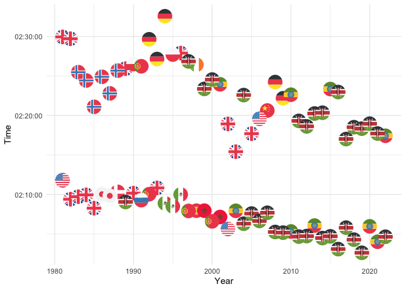

London Marathon
================

``` r
winners <- readr::read_csv('https://raw.githubusercontent.com/rfordatascience/tidytuesday/master/data/2023/2023-04-25/winners.csv')
```

    ## Rows: 163 Columns: 5
    ## ── Column specification ────────────────────────────────────────────────────────
    ## Delimiter: ","
    ## chr  (3): Category, Athlete, Nationality
    ## dbl  (1): Year
    ## time (1): Time
    ## 
    ## ℹ Use `spec()` to retrieve the full column specification for this data.
    ## ℹ Specify the column types or set `show_col_types = FALSE` to quiet this message.

``` r
WinnersTidy <- winners %>%
  filter(!grepl('Wheelchair', Category)) %>%
   mutate(Nationality = replace(Nationality, Nationality == 'United States' , 'us')) %>%
   mutate(Nationality = replace(Nationality, Nationality == 'Norway' , 'no')) %>%
   mutate(Nationality = replace(Nationality, Nationality == 'United Kingdom' , 'gb')) %>%
   mutate(Nationality = replace(Nationality, Nationality == 'Japan' , 'jp')) %>%
   mutate(Nationality = replace(Nationality, Nationality == 'Denmark' , 'dk')) %>%
   mutate(Nationality = replace(Nationality, Nationality == 'Kenya' , 'ke')) %>%
   mutate(Nationality = replace(Nationality, Nationality == 'Soviet Union' , 'ru')) %>%
   mutate(Nationality = replace(Nationality, Nationality == 'Portugal' , 'pt')) %>%
   mutate(Nationality = replace(Nationality, Nationality == 'Mexico' , 'mx')) %>%
   mutate(Nationality = replace(Nationality, Nationality == 'Spain' , 'es')) %>%
   mutate(Nationality = replace(Nationality, Nationality == 'Morocco' , 'ma')) %>%
   mutate(Nationality = replace(Nationality, Nationality == 'Ethiopia' , 'et')) %>%
   mutate(Nationality = replace(Nationality, Nationality == 'Poland' , 'pl')) %>%
   mutate(Nationality = replace(Nationality, Nationality == 'Germany' , 'de')) %>%
   mutate(Nationality = replace(Nationality, Nationality == 'Ireland' , 'ie')) %>%
   mutate(Nationality = replace(Nationality, Nationality == 'China' , 'cn'))
  

WinnersTidy
```

    ## # A tibble: 85 × 5
    ##    Category  Year Athlete              Nationality Time    
    ##    <chr>    <dbl> <chr>                <chr>       <time>  
    ##  1 Men       1981 Dick Beardsley (Tie) us          02:11:48
    ##  2 Men       1981 Inge Simonsen (Tie)  no          02:11:48
    ##  3 Men       1982 Hugh Jones           gb          02:09:24
    ##  4 Men       1983 Mike Gratton         gb          02:09:43
    ##  5 Men       1984 Charlie Spedding     gb          02:09:57
    ##  6 Men       1985 Steve Jones          gb          02:08:16
    ##  7 Men       1986 Toshihiko Seko       jp          02:10:02
    ##  8 Men       1987 Hiromi Taniguchi     jp          02:09:50
    ##  9 Men       1988 Henrik Jørgensen     dk          02:10:20
    ## 10 Men       1989 Douglas Wakiihuri    ke          02:09:03
    ## # ℹ 75 more rows

\#`!grepl` called within the filter function will filter out any rows
that contain a specific string within the category column in this
example.

``` r
WinnersTidy %>%
  distinct(Nationality)
```

    ## # A tibble: 16 × 1
    ##    Nationality
    ##    <chr>      
    ##  1 us         
    ##  2 no         
    ##  3 gb         
    ##  4 jp         
    ##  5 dk         
    ##  6 ke         
    ##  7 ru         
    ##  8 pt         
    ##  9 mx         
    ## 10 es         
    ## 11 ma         
    ## 12 et         
    ## 13 pl         
    ## 14 de         
    ## 15 ie         
    ## 16 cn

``` r
WinnersTidy %>%
  ggplot(aes(x = Year, y = Time)) +
  geom_flag( aes(country = Nationality), size = 7.5) +
  theme_minimal()
```

<!-- -->
