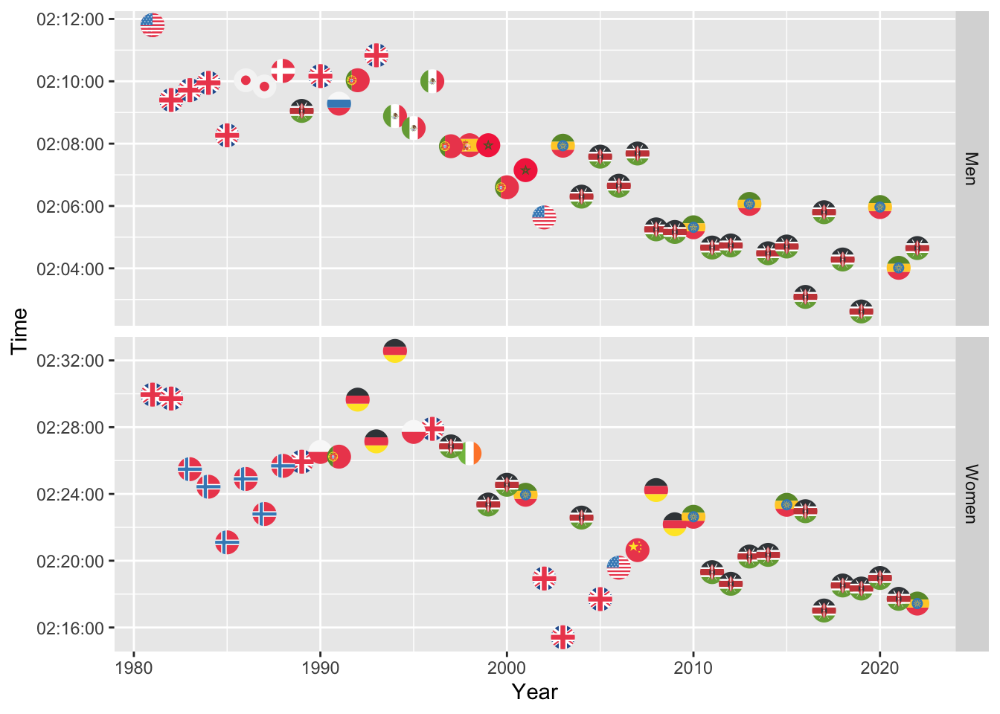

London Marathon
================

``` r
winners <- readr::read_csv('https://raw.githubusercontent.com/rfordatascience/tidytuesday/master/data/2023/2023-04-25/winners.csv')
```

    ## Rows: 163 Columns: 5
    ## ── Column specification ────────────────────────────────────────────────────────
    ## Delimiter: ","
    ## chr  (3): Category, Athlete, Nationality
    ## dbl  (1): Year
    ## time (1): Time
    ## 
    ## ℹ Use `spec()` to retrieve the full column specification for this data.
    ## ℹ Specify the column types or set `show_col_types = FALSE` to quiet this message.

``` r
winners %>%
  filter(!grepl('Wheelchair', Category)) -> WinnersTidy

WinnersTidy
```

    ## # A tibble: 85 × 5
    ##    Category  Year Athlete              Nationality    Time    
    ##    <chr>    <dbl> <chr>                <chr>          <time>  
    ##  1 Men       1981 Dick Beardsley (Tie) United States  02:11:48
    ##  2 Men       1981 Inge Simonsen (Tie)  Norway         02:11:48
    ##  3 Men       1982 Hugh Jones           United Kingdom 02:09:24
    ##  4 Men       1983 Mike Gratton         United Kingdom 02:09:43
    ##  5 Men       1984 Charlie Spedding     United Kingdom 02:09:57
    ##  6 Men       1985 Steve Jones          United Kingdom 02:08:16
    ##  7 Men       1986 Toshihiko Seko       Japan          02:10:02
    ##  8 Men       1987 Hiromi Taniguchi     Japan          02:09:50
    ##  9 Men       1988 Henrik Jørgensen     Denmark        02:10:20
    ## 10 Men       1989 Douglas Wakiihuri    Kenya          02:09:03
    ## # ℹ 75 more rows

\#`!grepl` called within the filter function will filter out any rows
that contain a specific string within the category column in this
example.

``` r
WinnersTidy %>%
  ggplot(aes(x = Year, y = Time)) +
  geom_point()
```

<!-- -->
